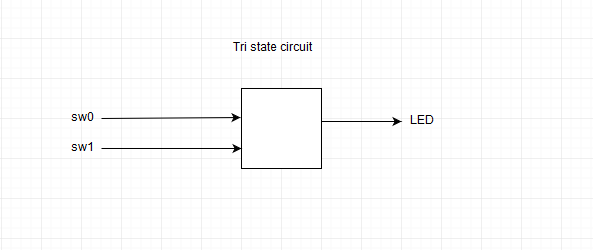

# Voltage Controlled Buffers  
Why doesn't **Vivado** allow two switches to control one LED?  Because one switch could try to send "on" to the LED. The other switch could try to send "off" to the LED.  They would fight.  Ultimately something would burn up .. the Nexys4 DDR board would be damaged. 

This is solved by moving from two states of on or off to three states or "triState" which include states of on, off and don't care.  Don't care has many names including "open" and "high  impedance", and "infinite output impedance".

#### Port Diagram

#### Verilog Code

module vcb(

​	input sw0,

​	input sw1,

​	output LED

);

tri LED;

bufif1 b1(LED, sw0, sw0);

bufif1 b2(LED, sw1, sw1);

endmodule

#### RTL Schematic Screen shot

#### Synthesis Schematic Screen shot

#### Implementation Device screen shot zoomed in on something interesting  

#### Testing

Here is the above different from the two state situation from the first lab.  When sw0 is 0, the tristate buffer doesn't try to ground the LED. It outputs nothing. *What is the difference between 0 (false) and nothing .. don't care .. high input impedance... etc?* 

Answer :  A zero(false) is no current flowing through the wire. A high input impedance or "don't care" is a state where any amount of current can flow and it will not affect the circuit

*What happens when both switches are zero (false)? What could happen?*

Answer: When both switches are zero(false), the output is in an open state

*So what is the difference between 0 and off?* 

off means the wire is disconnected, and 0 means no flow of current

*What is the difference between 0 and 1?* 

0 is no flow of current and 1 is a flow of current at 5

*What does a designer have to worry about when working with tri-state?* 

When working with tristate wires, the designer have to make sure that the wire is driven by some input at all times. Could be driven to 1 or driven to a 0.

*What kind of gate (and, nand, or, nor, xor, xnor, not) is this circuit?*

It's an AND gate

*Zoom in on a pull down resistor*

## BeCreative!

Hook the switches to the LED's in some creative way of your choice using the concepts you learned in this lab.  Think about the circuits that cell phones are going to control in your home. Imagine all the remotes, all the physical wall switches, all the on off  buttons and dimmer buttons in all devices begin controlled by your cell phone. You are designing a circuit to be imbedded in all devices and walls. 

#### Port Diagram

#### Verilog Code

module vcb(

​	input a,

​	input b,

​	input c,

​	output z

);

endmodule

#### RTL Schematic Screen shot

#### Synthesis Schematic Screen shot

#### Implementation Device screen shot zoomed in on something interesting

#### Testing

Many people are replacing light bulbs with LED's that last forever. Most are 12 volt DC.  They are being connected to AC through wall warts that waste energy. Some are running 12 volt systems in parallel with the AC. Some are using AC to switch the 12 volt. 

​	[wikipedia Multiway_Switching Traveler_system_2](https://en.wikipedia.org/wiki/Multiway_switching#Traveler_system_2)

There is a transition, a business opportunity, a standards opportunity here.  Compare the "3-way" and "4-way switches" at Home Depot or Lowes.  

*Can a voltage controlled buffer reduce the amount of copper needed?*

